<div align="center">


**Turn raw GitHub activity into developer intelligence. Activity. Consistency. Project quality. One score.**

[]()
[]()
[]()
[]()
[]()
[]()
[]()
[]()

</div>

---

## ✨ What is Gitora?

Gitora doesn't just count commits — it tells a **story** about your GitHub activity, consistency,
project quality, collaboration and open-source contributions, and rolls it all into a single
**Gitora Score**.

- 🚀 **Analyze any public GitHub profile** — no sign-up needed, no token required to try it
- 📊 **Five weighted pillars** feed into one transparent score (0–100)
- 🔥 **Streaks, active weeks & rhythm** measured from real commit activity
- 🏆 **Achievements** unlock as your profile tells its story
- 🗄️ **SQLite cache** keeps repeat views instant and GitHub-rate-limit friendly

## 🐍 Fresh out of the grass

A contribution snake, regenerated weekly from live data by GitHub Actions.


## 📊 Live stats

Animated counters and language bars, regenerated weekly so the numbers never go stale.



> The badge above is generated by `scripts/update_stats.py` and refreshed by the same
> [`contribution`](.github/workflows/contribution.yml) workflow that feeds the snake.

## 🧮 How the score works

Five pillars, each 0–100, weighted into the total:



| Pillar | Weight | Measures |
|---|---|---|
| **Activity** | × 0.20 | Commits, repositories, stars/forks, open issues |
| **Consistency** | × 0.25 | Active weeks, streaks, monthly rhythm |
| **Collaboration** | × 0.20 | Issues, forks, community engagement — *partial without a token* |
| **Project Quality** | × 0.20 | README, license, docs, stars/forks, maintenance recency |
| **Open Source** | × 0.15 | Public repos, external contributions — *partial without a token* |

> **Gitora Score is a custom metric created by Gitora based on public GitHub data. It is not
> affiliated with or endorsed by GitHub, and is a rough estimate, not an official rating.**

## 🚀 Quickstart

### Backend — FastAPI + httpx + SQLite

Requires Python 3.12+.

```bash
cd backend
python3 -m venv .venv
source .venv/bin/activate
pip install -e ".[dev]"
cp .env.example .env      # optional, defaults are fine
uvicorn app.main:app --reload --port 8000
```

> **Rate limits & tokens:** GitHub's anonymous API allows only 60 requests/hour,
> and one analysis can use ~30–45 of them. For public deployments, set
> `GITORA_GITHUB_TOKEN` in `.env` (5,000 requests/hour). Results are cached for
> 6 hours and concurrent requests for the same profile are coalesced, which
> keeps the anonymous limits workable for personal use. The `/api/v1/analyze`
> endpoint is also rate-limited per IP (default 10 requests / 10 min) and by a
> global daily cap (200) — tune via `GITORA_API_RATE_LIMIT`,
> `GITORA_API_RATE_WINDOW_SECONDS` and `GITORA_API_GLOBAL_DAILY_LIMIT`.

### Frontend — React + TypeScript + Vite + Tailwind

Requires Node 18+.

```bash
cd frontend
npm install
npm run dev        # http://localhost:5173, /api proxied to :8000
```

Pages: `/` landing, `/analyze` analyzer, `/dashboard/:username` analytics dashboard.

## 🔌 API

| Method | Path | Description |
|---|---|---|
| GET | `/api/v1/health` | Liveness check |
| GET | `/api/v1/analyze/{username}` | Fetch, analyze and cache a GitHub user |
| GET | `/api/v1/analyze/{username}?force=true` | Bypass cache and re-fetch |

```bash
curl -s localhost:8000/api/v1/analyze/octocat | python3 -m json.tool
```

## 🏗️ Architecture

```
                    USER
                      │
                      ▼
              React Frontend
                      │
                  REST API
                      ▼
             FastAPI Backend  ──────►  GitHub REST API
                      │
          ┌───────────┼────────────┐
          ▼           ▼            ▼
   Score Engine   Metrics     SQLite Cache
          │           │            │
          └───────────┼────────────┘
                      ▼
                Gitora Analytics
```

| Module | Responsibility |
|---|---|
| `app/github/client.py` | httpx client, pagination, rate-limit + 404 handling, request budget |
| `app/analysis/metrics.py` | Languages, streaks, growth, weekly series |
| `app/analysis/score.py` | Five-pillar scoring engine (pure functions, weighted total) |
| `app/analysis/achievements.py` | Badge rules as pure functions |
| `app/analysis/service.py` | Orchestrates fetch → analyze → cache |
| `app/db/cache.py` | SQLite cache of analysis payloads with TTL |

## 🧪 Testing

```bash
cd backend
source .venv/bin/activate
pytest -q
```

## 🚢 Deployment

The whole app ships as a **single container**: FastAPI serves the built React
frontend (SPA fallback included), so `/api/*` and `/` live on one origin — no
CORS, no separate hosting.

```bash
docker build -t gitora:demo-v1 .
docker run --rm -p 8000:8000 -e GITORA_GITHUB_TOKEN=ghp_xxx gitora:demo-v1
```

> `GITORA_GITHUB_TOKEN` is a deploy secret — never put it in the repo. It boosts
> the GitHub API limit from 60 to 5,000 requests/hour.

**Render (free)** — connect the repo, Render picks up `render.yaml`, then set
`GITORA_GITHUB_TOKEN` as a secret. Health check: `/api/v1/health`.

**Railway / Fly.io** — deploy the Dockerfile directly; both inject a `PORT` env
that the container honors.

**VPS with Docker** — `docker compose up -d` (reads `GITORA_GITHUB_TOKEN` from a
server-side `.env`; SQLite cache persists in a named volume).

> The SQLite cache is ephemeral on PaaS free tiers (resets on redeploy) — fine
> for a demo. The docker-compose setup keeps it on disk.

## 🗺️ Roadmap

- [x] **V1** — Analyze → Score → Activity → Languages → Repositories → Achievements
- [x] **V2** — React dashboard, shareable profiles, comparison
- [ ] **V3** — Gitora AI insights and recommendations

<div align="center">

Made with 💜 · [GhoshCodes201](https://github.com/GhoshCodes201) · © 2026

</div>
